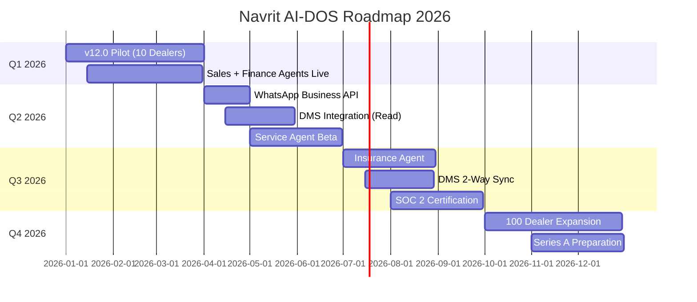

# Navrit AI-DOS
## Functional Specification Document (FSD) v1.0

**Document Version:** 1.0  
**Date:** January 31, 2026  
**Classification:** Board-Ready | Confidential

---

## 1. PRODUCT VISION

### 1.1 Mission Statement

> **Stop $192,000 in annual revenue leakage per dealership** through intelligent process orchestration.

The automotive retail industry in Southeast Asia loses an estimated 40-60% of potential revenue due to:
- Lead duplication and misattribution (15-20%)
- Delayed title transfer and registration workflows (10-15%)
- Missed financing and insurance cross-sell opportunities (15-25%)

### 1.2 Core Concept: The Orchestration Layer

Navrit AI-DOS is **not** a rip-and-replace DMS. It is an **Orchestration Layer** that:

```
┌─────────────────────────────────────────────────────────────┐
│                    EXISTING SYSTEMS                          │
│  ┌─────────┐  ┌─────────┐  ┌─────────┐  ┌─────────┐        │
│  │ Legacy  │  │  Bank   │  │Insurance│  │  OEM    │        │
│  │   DMS   │  │   API   │  │   API   │  │ Portal  │        │
│  └────┬────┘  └────┬────┘  └────┬────┘  └────┬────┘        │
│       │            │            │            │              │
│       ▼            ▼            ▼            ▼              │
│  ╔═══════════════════════════════════════════════════╗     │
│  ║            NAVRIT AI-DOS CORE                      ║     │
│  ║  ┌─────────┐ ┌─────────┐ ┌─────────┐ ┌─────────┐  ║     │
│  ║  │ SALES   │ │ FINANCE │ │INSURANCE│ │ SERVICE │  ║     │
│  ║  │ AGENT   │ │ AGENT   │ │ AGENT   │ │ AGENT   │  ║     │
│  ║  └─────────┘ └─────────┘ └─────────┘ └─────────┘  ║     │
│  ║                    ▲                               ║     │
│  ║           RULE ENGINE (Node Hierarchy)             ║     │
│  ╚═══════════════════════════════════════════════════╝     │
│                          │                                  │
│       ┌──────────────────┼──────────────────┐              │
│       ▼                  ▼                  ▼              │
│  ┌─────────┐       ┌─────────┐        ┌─────────┐         │
│  │ Mobile  │       │WhatsApp │        │ Desktop │         │
│  │   PWA   │       │   Bot   │        │   Web   │         │
│  └─────────┘       └─────────┘        └─────────┘         │
└─────────────────────────────────────────────────────────────┘
```

### 1.3 Target Markets

| Market | Priority | Rationale |
|--------|----------|-----------|
| **Indonesia** | P0 | 1.2M units/year, fragmented DMS landscape |
| **Philippines** | P1 | Strong Honda/Toyota presence, title transfer complexity |
| **Malaysia** | P2 | High digital adoption, established OEM relationships |

---

## 2. SYSTEM ARCHITECTURE

### 2.1 Technology Stack

| Layer | Technology | Rationale |
|-------|------------|-----------|
| **Database** | Supabase (PostgreSQL) | Row-Level Security, Real-time subscriptions |
| **Backend** | Node.js + Prisma ORM | Type-safe queries, migration management |
| **Frontend** | React + Vite + TailwindCSS | PWA-ready, Apple-grade UX |
| **Hosting** | Netlify (Edge) + Supabase | SEA edge locations, <100ms latency |

### 2.2 Node-Level Rule Engine

The core differentiator is the **Hierarchical Rule Engine**:

```
BRAND (Honda, Toyota)
  └── GROUP (Dealer Networks)
       └── DEALER (Individual Showrooms)
            └── MANAGER (Team Leads)
                 └── USER (Sales Consultants)
```

**Rule Cascade Logic:**
1. Higher-level rules OVERRIDE lower-level rules
2. `CONSTRAINT` rules block actions (e.g., max discount %)
3. `INCENTIVE` rules enable bonuses (e.g., SPIFF for loans)
4. `PROCESS` rules enforce workflows (e.g., 13-step Title Transfer)

### 2.3 Security & Compliance

| Requirement | Implementation | Status |
|-------------|----------------|--------|
| Data Isolation | Supabase RLS (Row-Level Security) | ✅ Live |
| Audit Logging | All mutations logged with user_id + timestamp | ✅ Live |
| Encryption | TLS 1.3 in transit, AES-256 at rest | ✅ Live |
| SOC 2 Type II | Pre-audit checklist complete | 🟡 Q2 2026 |

---

## 3. MODULE SPECIFICATIONS

### 3.1 SALES AGENT (v12.0 - LIVE)

**Purpose:** Convert leads to bookings faster than competition.

#### Features Implemented

| Feature | Component | Logic File |
|---------|-----------|------------|
| Cockpit Feed | `ProRow.tsx` | Real-time lead cards with priority badges |
| Duplicate Detection | `HondaRules.ts` | Blocks same phone + model leads |
| Speed-to-Lead Alerts | `MockEngine.ts` | Last active days tracking |
| Title Transfer Workflow | `TitleTransferEngine.ts` | 8-step flow with TAT breach detection |
| Voice Command (Jarvis) | `ActionDock.tsx` | Hold-to-talk with haptic feedback |

#### Wireframe: ProRow Component
```
┌────────────────────────────────────────────────────┐
│ [HOT A] │ Rahul Sharma          │ ₹14.5k │ 10:00 │
│         │ Honda City ZX         │        │  AM   │
│         │ Negotiation           │        │       │
├─────────┴───────────────────────┴────────┴───────┤
│ [Call] [WA] [MIC] [Quote] [Close]                │
└──────────────────────────────────────────────────┘
```

---

### 3.2 FINANCE AGENT (v12.0 - LIVE)

**Purpose:** Maximize financing penetration and incentive capture.

#### Features Implemented

| Feature | Component | Logic File |
|---------|-----------|------------|
| Vertical Receipt | `VerticalReceipt.tsx` | Ex-showroom → Net breakdown |
| UCRF Calculator | `UCRFCalculator.ts` | 10% WHT deduction logic |
| AI Deal Architect | `AIDealArchitect.tsx` | 3 pre-calculated scenarios |
| Deal Structuring | `DealArchitect.ts` | Central orchestrator |

#### UCRF Math Formula
```typescript
const TAX_RATE = 0.10; // 10% Withholding Tax
const baseIncentive = loanAmount * baseRate;    // e.g., 4%
const topUpIncentive = loanAmount * topUp;      // e.g., 1%
const gross = baseIncentive + topUpIncentive;
const net = gross - (gross * TAX_RATE);
```

---

### 3.3 INSURANCE AGENT (GAP)

**Current State:** Basic status tracking only.

**Future Roadmap:**
- Policy matching engine (compare 5+ providers)
- Renewal reminder automation (30/15/7 day triggers)
- Commission tracking per policy type

---

### 3.4 SERVICE AGENT (GAP)

**Current State:** Not implemented.

**Future Roadmap:**
- Bay optimization (reduce wait times)
- Proactive service reminders (oil change, warranty expiry)
- Parts inventory sync

---

## 4. GAP ANALYSIS

### 4.1 Implementation Status

| Capability | Status | Notes |
|------------|--------|-------|
| Lead Management | ✅ Complete | ProRow, Priority System |
| Duplicate Detection | ✅ Complete | HondaRules.ts |
| Title Transfer Workflow | ✅ Complete | 8-step engine with TAT |
| UCRF/Finance Math | ✅ Complete | 10% WHT logic |
| Rule Engine Hierarchy | ✅ Complete | Brand → User cascade |
| Voice Commands | ✅ Complete | Jarvis ActionDock |
| AI Deal Structuring | ✅ Complete | 3-scenario architect |

### 4.2 Critical Gaps

| Gap | Priority | Effort | Target |
|-----|----------|--------|--------|
| **DMS Integration** | P0 | 6 weeks | Q2 2026 |
| **WhatsApp Business API** | P0 | 4 weeks | Q2 2026 |
| **Live VIN Decoding** | P1 | 2 weeks | Q2 2026 |
| **Insurance Agent** | P1 | 8 weeks | Q3 2026 |
| **Service Agent** | P2 | 12 weeks | Q4 2026 |

---

## 5. COMPETITIVE BENCHMARK

### 5.1 Navrit vs. Enterprise CRM

| Dimension | Salesforce/Dynamics | Navrit AI-DOS |
|-----------|---------------------|---------------|
| **Setup Time** | 6-12 months | 2 weeks |
| **Cost** | $150k+ annually | $199/user/month |
| **Logic** | Empty shell (custom dev) | Embedded (Honda Rules, Title Transfer) |
| **Localization** | Generic | SEA-specific (LTO, WHT, Barangay) |

### 5.2 Navrit vs. Local DMS

| Dimension | Legacy DMS | Navrit AI-DOS |
|-----------|------------|---------------|
| **Architecture** | On-premise silos | Cloud-native orchestrator |
| **UX** | Windows XP era | Apple Pro 2026 |
| **Intelligence** | None | Rule Engine + AI Scenarios |
| **Integration** | None | API-first |

---

## 6. ROADMAP



---

## 7. APPENDIX

### 7.1 Code Repository Structure

```
navrit-mvp-app/
├── client/src/
│   ├── components/
│   │   ├── ProRow.tsx          # Lead cards
│   │   ├── ActionDock.tsx      # Jarvis voice
│   │   ├── AIDealArchitect.tsx # Finance scenarios
│   │   └── VerticalReceipt.tsx # Deal math display
│   └── services/
│       ├── HondaRules.ts       # Duplicate detection
│       ├── TitleTransferEngine.ts # 8-step workflow
│       ├── UCRFCalculator.ts   # 10% WHT logic
│       ├── DealArchitect.ts    # Central orchestrator
│       └── RuleEngine.ts       # Node hierarchy
├── prisma/
│   └── schema.prisma           # TitleTransfer, Refinance models
└── netlify.toml                # Deployment config
```

### 7.2 Key Metrics (Target)

| Metric | Current | Target (Q4 2026) |
|--------|---------|------------------|
| Lead Response Time | Unknown | <5 minutes |
| Title Transfer TAT | 14 days avg | 7 days |
| Finance Penetration | 40% | 65% |
| Insurance Attachment | 60% | 85% |

---

**Document Prepared By:** Navrit AI-DOS Engineering  
**Next Review:** March 31, 2026
