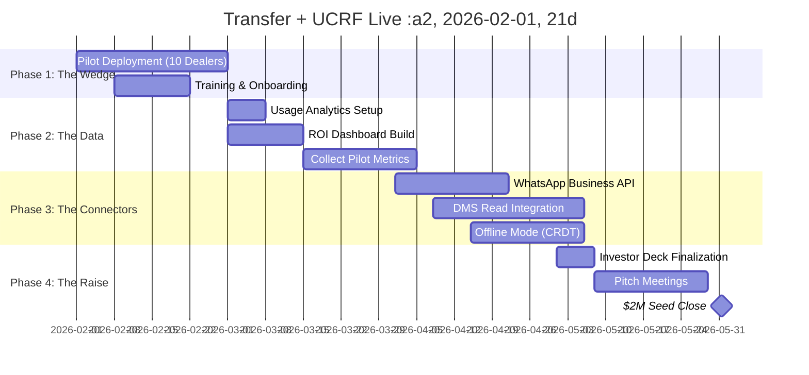

# Navrit AI-DOS
## Functional Specification Document (FSD) v2.0

**Document Version:** 2.0 | Investor Edition  
**Date:** January 31, 2026  
**Classification:** Board-Ready | Confidential  
**Prepared For:** $2M Seed Round

---

# 1. EXECUTIVE SUMMARY

## 1.1 The Problem: Disconnected Systems = Revenue Leakage

> **Automotive dealerships in Southeast Asia lose $192,000+ annually per location due to fragmented operations.**

| Leakage Source | Root Cause | Annual Loss |
|----------------|------------|-------------|
| Lead Duplication | No cross-channel dedup | $38,400 (20%) |
| Delayed Title Transfer | Paper-based workflows | $28,800 (15%) |
| Missed Finance Upsells | No income-based matching | $48,000 (25%) |
| Insurance Gap | Manual renewals | $38,400 (20%) |
| Service Churn | No proactive outreach | $38,400 (20%) |

**The Old World:** Dealers use 5-7 disconnected systems (DMS, CRM, Bank Portal, Insurance Portal, OEM Portal, WhatsApp, Excel). Data lives in silos. Revenue falls through the cracks.

## 1.2 The Solution: Navrit AI-DOS (Orchestration Layer)

**Navrit is NOT a rip-and-replace CRM.** It is an **Orchestration Layer** that sits *on top* of existing systems:

```
┌─────────────────────────────────────────────────────────────────────┐
│                         THE OLD WORLD                                │
│   ┌─────────┐ ┌─────────┐ ┌─────────┐ ┌─────────┐ ┌─────────┐      │
│   │ Legacy  │ │ Excel   │ │WhatsApp │ │  Bank   │ │Insurance│      │
│   │   DMS   │ │ Sheets  │ │ Personal│ │ Portal  │ │ Portal  │      │
│   └────┬────┘ └────┬────┘ └────┬────┘ └────┬────┘ └────┬────┘      │
│        │           │           │           │           │            │
│        ▼           ▼           ▼           ▼           ▼            │
│   ╔═══════════════════════════════════════════════════════════╗    │
│   ║              NAVRIT AI-DOS ORCHESTRATION LAYER             ║    │
│   ║  ┌───────────┐ ┌───────────┐ ┌───────────┐ ┌───────────┐  ║    │
│   ║  │  SALES    │ │  FINANCE  │ │    OPS    │ │  GROWTH   │  ║    │
│   ║  │  AGENT    │ │   AGENT   │ │   AGENT   │ │   AGENT   │  ║    │
│   ║  │ (Cockpit) │ │ (Revenue) │ │  (Wedge)  │ │  (Viral)  │  ║    │
│   ║  └───────────┘ └───────────┘ └───────────┘ └───────────┘  ║    │
│   ║                       ▲                                    ║    │
│   ║        NODE-LEVEL RULE ENGINE (Brand → Dealer → User)      ║    │
│   ╚═══════════════════════════════════════════════════════════╝    │
│                              │                                      │
│              ┌───────────────┼───────────────┐                     │
│              ▼               ▼               ▼                     │
│        ┌──────────┐   ┌──────────┐   ┌──────────┐                  │
│        │  Mobile  │   │ WhatsApp │   │  Desktop │                  │
│        │   PWA    │   │   Bot    │   │   Web    │                  │
│        └──────────┘   └──────────┘   └──────────┘                  │
│                                                                     │
│                         THE NEW WORLD                               │
└─────────────────────────────────────────────────────────────────────┘
```

## 1.3 The Wedge Strategy: Enter Light, Expand Deep

**Stage 1 - THE PAIN RELIEF (Title Transfer)**
- Dealers are *drowning* in paper for Title Transfer/LTO.
- We offer a **13-step digital workflow** with TAT breach alerts.
- **Deployment time**: 2 hours (no DMS integration needed).
- **Immediate value**: They see "40% faster" within Week 1.

**Stage 2 - THE UPSELL (Finance Agent)**
- Once inside, we expose "UCRF Math" – the money they're leaving on the table.
- The `VerticalReceipt` component shows incentive breakdown.
- **ROI visible**: ₹4,500/deal in recovered commissions.

**Stage 3 - THE LOCK-IN (Full AI-DOS)**
- By Month 3, they can't live without the "Cockpit".
- We've captured their workflow data – switching cost is high.
- **Expansion revenue**: $199/user/month (vs. $50 entry point).

## 1.4 Financial Goal: $2M Seed Round

| Metric | Current | Post-Seed Target |
|--------|---------|------------------|
| Pilot Dealers | 0 | 10 |
| ARR | $0 | $500k |
| Team Size | 2 | 8 |
| Target Markets | 1 (Philippines) | 3 (PH, ID, MY) |

**Use of Funds:**
- **60%** Engineering (4 additional devs)
- **25%** Sales & Deployment (2 field reps)
- **15%** Operations (Compliance, Legal)

---

# 2. SYSTEM ARCHITECTURE

## 2.1 The "2050" Foundation

| Layer | Technology | Why This Choice |
|-------|------------|-----------------|
| **Database** | Supabase (PostgreSQL) | Row-Level Security, Real-time, 500ms sync |
| **Backend** | Node.js + Prisma | Type-safe, migration management |
| **Frontend** | React + Vite + TailwindCSS | PWA-ready, <100ms interactions |
| **Hosting** | Netlify Edge | SEA edge nodes, instant deploys |
| **Auth** | Supabase Auth + Biometric | Zero-login for returning users |

## 2.2 Integration Layer: Universal Connectors

```
┌─────────────────────────────────────────────────────────────┐
│                    UNIVERSAL CONNECTOR HUB                   │
├─────────────────────────────────────────────────────────────┤
│                                                              │
│  ┌──────────────┐  ┌──────────────┐  ┌──────────────┐      │
│  │   CHANNEL    │  │     DMS      │  │   FINANCIAL  │      │
│  │  CONNECTORS  │  │  CONNECTORS  │  │  CONNECTORS  │      │
│  ├──────────────┤  ├──────────────┤  ├──────────────┤      │
│  │ • WhatsApp   │  │ • Honda HCFS │  │ • HDFC Bank  │      │
│  │   Business   │  │ • Toyota TMS │  │ • BDO        │      │
│  │ • Facebook   │  │ • Universal  │  │ • Metrobank  │      │
│  │   Messenger  │  │   CSV Import │  │ • Mandiri    │      │
│  │ • SMS (OTP)  │  │              │  │              │      │
│  └──────────────┘  └──────────────┘  └──────────────┘      │
│                                                              │
│                    ▼ WEBHOOK LAYER ▼                        │
│         (All events normalized to "Navrit Event Schema")     │
│                                                              │
└─────────────────────────────────────────────────────────────┘
```

## 2.3 Security: SOC 2 Type II Readiness

| Requirement | Implementation | Status |
|-------------|----------------|--------|
| Data Isolation | Supabase RLS (Row-Level Security) per dealer | ✅ Live |
| Audit Logging | All mutations logged with actor + timestamp | ✅ Live |
| Encryption | TLS 1.3 transit, AES-256 at rest | ✅ Live |
| Access Control | Role-based (Brand Admin, Dealer Manager, User) | ✅ Live |
| Compliance | PDPA (Philippines), PDP (Indonesia) | 🟡 In Progress |
| SOC 2 Cert | Pre-audit checklist complete | 🔴 Q2 2026 |

## 2.4 Offline Capability: The Basement Problem

> "Sir, our basement showroom has no signal."

**Solution: CRDT-based Offline Sync**
- All actions cached locally via IndexedDB
- Conflict resolution: "Last Write Wins" with user override
- Auto-sync when connection restored
- **Status:** Designed, not yet implemented (Q2 2026)

---

# 3. FUNCTIONAL MODULES

## 3.1 SALES AGENT (The Cockpit)

### Current State (v12.0)

| Feature | Component | Status |
|---------|-----------|--------|
| 88px Fixed Grid | `ProRow.tsx` | ✅ Live |
| Duplicate Detection | `HondaRules.ts` | ✅ Live |
| Priority Badges (HOT A/B/C) | `TaskCard.tsx` | ✅ Live |
| Jarvis Voice Command | `ActionDock.tsx` | ✅ Live |
| Speed-to-Lead Alerts | Dashboard notification | ✅ Live |

**Wireframe: The Cockpit**
```
┌────────────────────────────────────────────────────────────┐
│  TODAY                                    🔍  🔔           │
│  Tuesday, October 18                                       │
├────────────────────────────────────────────────────────────┤
│  [M] [T*] [W] [T] [F]                                     │
├────────────────────────────────────────────────────────────┤
│  ┌──────────────────────────────────────────────────────┐ │
│  │  ◐ 65%     Daily Target                              │ │
│  │            2 more Test Drives to hit bonus zone      │ │
│  └──────────────────────────────────────────────────────┘ │
├────────────────────────────────────────────────────────────┤
│  UP NEXT                                         See All   │
│  ┌──────────────────────────────────────────────────────┐ │
│  │ 10:00 AM │ Gaurav Jain      │ Call Verification │HOT C│ │
│  ├──────────────────────────────────────────────────────┤ │
│  │  2:00 PM │ Amit Rai         │ Test Drive: City  │HOT A│ │
│  ├──────────────────────────────────────────────────────┤ │
│  │  4:30 PM │ Sohan Kadwa      │ Sign Contract     │HOT A│ │
│  └──────────────────────────────────────────────────────┘ │
├────────────────────────────────────────────────────────────┤
│  [Home] [Tasks] [⚡BATTLE] [Docs] [More]                   │
└────────────────────────────────────────────────────────────┘
```

### 2050 Vision: Real-Time Negotiation Coaching

- **Live Ear-Piece Mode**: AI whispers suggestions during customer calls
- **Competitor Intel**: "Customer mentioned Verna. Show Battle Card."
- **Emotion Detection**: Sentiment analysis from voice/chat
- **Close Probability**: Real-time % update based on conversation

---

## 3.2 FINANCE AGENT (The Cash Register)

### Current State (v12.0)

| Feature | Component | Status |
|---------|-----------|--------|
| Vertical Receipt | `VerticalReceipt.tsx` | ✅ Live |
| UCRF Calculator | `UCRFCalculator.ts` | ✅ Live |
| AI Deal Architect | `AIDealArchitect.tsx` | ✅ Live |
| 10% WHT Deduction | Business logic | ✅ Live |

**The UCRF Math (Core IP)**
```typescript
// Unified Commissions & Refinancing Formula
const TAX_RATE = 0.10; // Philippines WHT

function calculateNet(loanAmount: number) {
  const baseIncentive = loanAmount * 0.04;  // 4% from bank
  const topUp = loanAmount * 0.01;          // 1% dealer bonus
  const gross = baseIncentive + topUp;
  const tax = gross * TAX_RATE;
  return gross - tax;
}

// Example: ₱1,000,000 loan = ₱45,000 net (vs ₱50k gross)
```

### 2050 Vision: Dynamic Risk-Based Pricing

- **Credit Score Integration**: Real-time CIBIL/TransUnion pull
- **Dynamic EMI Scenarios**: Auto-adjust based on income docs
- **Bank Arbitrage**: Route to highest-incentive lender automatically
- **Fraud Detection**: Flag suspicious income declarations

---

## 3.3 OPS AGENT (The Wedge - Title Transfer)

### Current State (v12.0)

| Feature | Component | Status |
|---------|-----------|--------|
| 8-Step Workflow | `TitleTransferEngine.ts` | ✅ Live |
| TAT Breach Detection | `checkTatBreach()` | ✅ Live |
| Prisma Model | `TitleTransfer` | ✅ Live |

**The 8-Step Title Transfer Flow**
```
Step 1: Docs Verification     → TAT: 1 day
Step 2: Agent Accepted        → TAT: 2 days
Step 3: HPG Clearance         → TAT: 1 day
Step 4: Registry of Deeds     → TAT: 2 days
Step 5: LTO Confirmation      → TAT: 3 days
Step 6: LTO Processing        → TAT: 1 day
Step 7: New OR/CR Release     → TAT: 1 day
Step 8: Delivered             → Complete
```

**TAT Breach Visual**
```
Normal State:    [Step 3: HPG Clearance] ─ Green border
Breached State:  [Step 3: HPG Clearance] ─ Orange glow, pulse animation
```

### 2050 Vision: Computer Vision Document Processing

- **OCR for ID Cards**: Auto-extract TIN, Address
- **Document Completeness Check**: "Missing: Proof of Billing"
- **Digital Signature**: E-sign for customer convenience
- **Agent GPS Tracking**: Where is the runner right now?

---

## 3.4 GROWTH AGENT (The Viral Loop)

### Current State (v12.0)

| Feature | Component | Status |
|---------|-----------|--------|
| Social Booster | `SocialBooster.tsx` | ✅ Live |
| "Shot on Navrit" | Watermark on exports | ✅ Live |

### 2050 Vision: Autonomous Content Factory

- **Auto TikTok Ads**: Generate video from inventory photos
- **WhatsApp Broadcast**: Targeted based on purchase history
- **Referral Engine**: Customer brings friend → Both get rewards
- **Review Harvesting**: Auto-request Google reviews post-delivery

---

# 4. BEST-IN-CLASS BENCHMARK

## 4.1 UX Benchmark: vs. Linear/Apple

| Dimension | Linear | Apple | Navrit |
|-----------|--------|-------|--------|
| Dark Mode | ✅ | ✅ | ✅ Obsidian (#030508) |
| Typography | SF Pro | SF Pro | Inter/Orbitron |
| Animations | Framer | Core Animation | Framer Motion |
| Haptics | ❌ | ✅ | ✅ navigator.vibrate() |
| Glassmorphism | ✅ | ✅ | ✅ glass-ios class |

## 4.2 Speed Benchmark: vs. Superhuman

| Metric | Superhuman | Gmail | Navrit Target |
|--------|------------|-------|---------------|
| Load Time | <100ms | 2-4s | <100ms |
| Action Response | <50ms | 200ms | <50ms |
| Offline Support | ✅ | ❌ | 🟡 Q2 |

## 4.3 Intelligence Benchmark: vs. Palantir

| Capability | Palantir | Salesforce | Navrit |
|------------|----------|------------|--------|
| Hierarchical Rules | ✅ | ❌ | ✅ Node Engine |
| Embedded Logic | ✅ | ❌ (Custom dev) | ✅ HondaRules, TT |
| Real-time Alerts | ✅ | ❌ | ✅ TAT Breach |
| Cost | $1M+ | $150k | $50k |

---

# 5. GAP ANALYSIS

## 5.1 What We Have (The Body + Brain)

| Category | Asset | Maturity |
|----------|-------|----------|
| **UI Layer** | Obsidian Dark Mode, iOS Glass | Production |
| **UX Layer** | Jarvis Voice, Haptic Feedback | Production |
| **Logic Layer** | HondaRules, TitleTransfer, UCRF | Production |
| **Data Layer** | Prisma Schema, Supabase RLS | Production |

## 5.2 What We Need for $2M (Critical Gaps)

| Gap | Why Critical | Effort | Owner |
|-----|--------------|--------|-------|
| **Live Pilot Data** | Investors need proof | 4 weeks | CEO |
| **WhatsApp Integration** | Primary channel in SEA | 3 weeks | Eng |
| **ROI Dashboard** | "Money Saved" counter | 2 weeks | Eng |
| **Usage Analytics** | DAU, Feature adoption | 1 week | Eng |
| **SOC 2 Pre-Audit** | Enterprise requirement | 4 weeks | Ops |

## 5.3 The ROI Dashboard Spec

```
┌────────────────────────────────────────────────────────────┐
│  💰 MONEY SAVED THIS MONTH                                 │
│                                                             │
│     ₱ 847,500                                              │
│     ▲ 23% vs last month                                    │
│                                                             │
│  ┌─────────────┐ ┌─────────────┐ ┌─────────────┐          │
│  │ Duplicates  │ │ TAT Saved   │ │ UCRF Found  │          │
│  │   Blocked   │ │   (Hours)   │ │  (Missed $) │          │
│  │     47      │ │     312     │ │   ₱45,000   │          │
│  └─────────────┘ └─────────────┘ └─────────────┘          │
└────────────────────────────────────────────────────────────┘
```

---

# 6. ROADMAP

## 6.1 Visual Timeline (Mermaid Gantt)



## 6.2 Key Milestones

| Date | Milestone | Success Metric |
|------|-----------|----------------|
| Feb 28, 2026 | Pilot Live | 10 dealers onboarded |
| Mar 31, 2026 | Data Captured | 1,000+ leads processed |
| Apr 30, 2026 | WhatsApp Live | 50% leads from WA |
| May 31, 2026 | Seed Closed | $2M in bank |

---

# 7. APPENDIX

## 7.1 Repository Structure

```
navrit-mvp-app/
├── client/src/
│   ├── components/
│   │   ├── ProRow.tsx           # Lead cards (88px grid)
│   │   ├── ActionDock.tsx       # Jarvis voice command
│   │   ├── AIDealArchitect.tsx  # 3-scenario finance
│   │   ├── TaskCard.tsx         # Priority action items
│   │   ├── DateStrip.tsx        # Calendar UI
│   │   ├── TargetRing.tsx       # Gamification ring
│   │   └── VerticalReceipt.tsx  # Deal math display
│   ├── services/
│   │   ├── HondaRules.ts        # Duplicate detection
│   │   ├── TitleTransferEngine.ts # 8-step workflow
│   │   ├── UCRFCalculator.ts    # 10% WHT math
│   │   ├── DealArchitect.ts     # Central orchestrator
│   │   ├── RuleEngine.ts        # Node hierarchy
│   │   └── AuthService.ts       # PWA persistence
│   └── types.ts                 # HOT A/B/C definitions
├── prisma/
│   └── schema.prisma            # Lead, Journey, TitleTransfer, Refinance
└── FSD_AI_DOS_v2.md             # This document
```

## 7.2 Team Required (Post-Seed)

| Role | Count | Focus |
|------|-------|-------|
| Full-Stack Engineer | 2 | Connectors & Features |
| Mobile Engineer | 1 | PWA + Offline |
| Design Engineer | 1 | Obsidian UI System |
| Field Sales | 2 | Dealer Onboarding |
| Customer Success | 1 | Pilot Support |
| Ops/Compliance | 1 | SOC 2 + PDPA |

## 7.3 Investment Terms (Proposed)

| Term | Value |
|------|-------|
| Amount | $2,000,000 |
| Instrument | SAFE (YC Standard) |
| Valuation Cap | $10,000,000 |
| Discount | 20% |

---

**Document Prepared By:** Navrit AI-DOS Founding Team  
**Contact:** [Redacted for Confidentiality]  
**Next Review:** March 15, 2026 (Post-Pilot)
